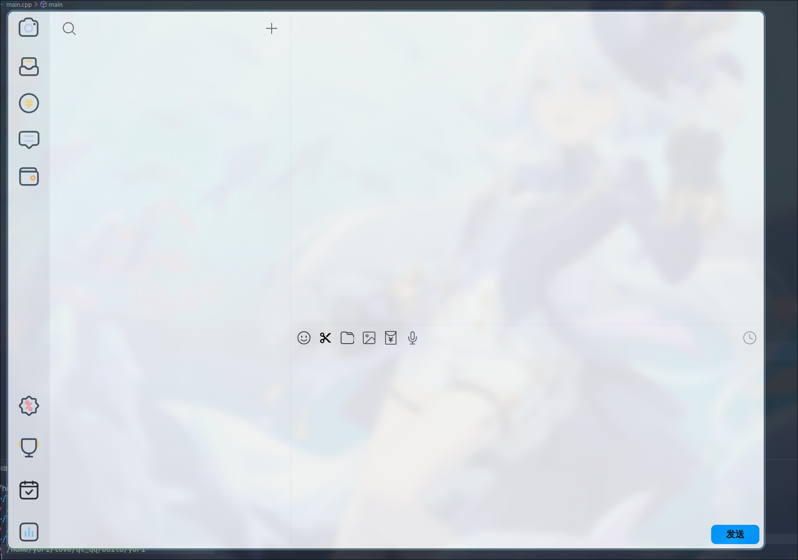

# qq

> 模仿qq nt界面
>
> 因各种原因现项目已停更

## 基于qt6

默认添加以下模块 
1. Widgets
2. Sql
3. Network
4. StateMachine

```cpp
cmake 默认检索目录
include -> 头文件
src     -> 源文件
ui      -> ui文件
qrc     -> 资源管理文件
```

## 显示效果



## 已经实现效果

1. 拖动样式,界面切换
2. 按钮触摸效果
3. tcp通信(未实装)
